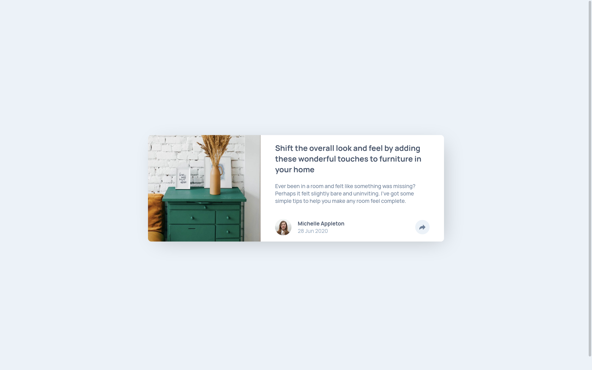
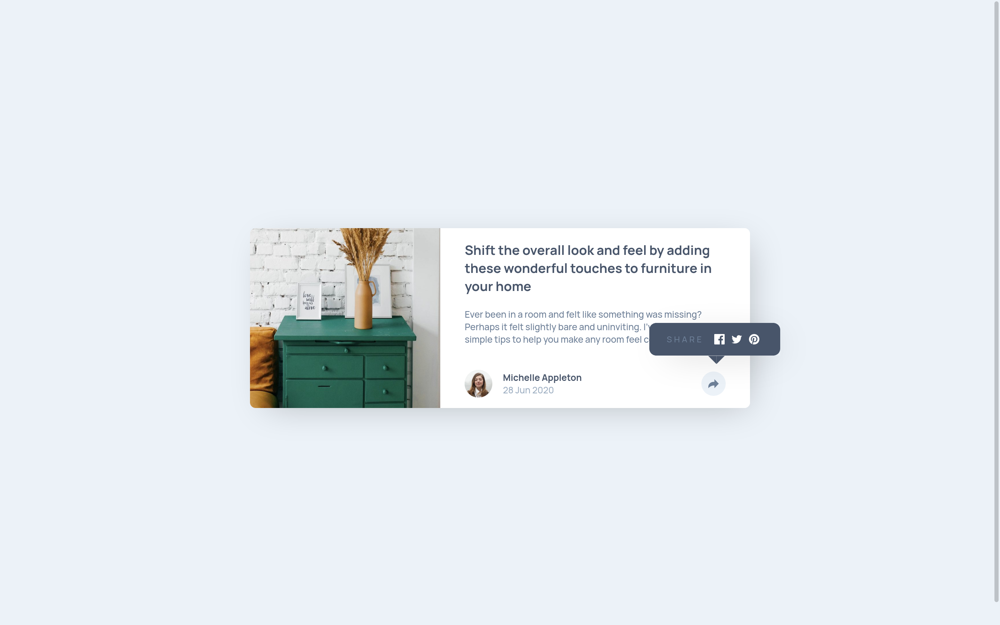
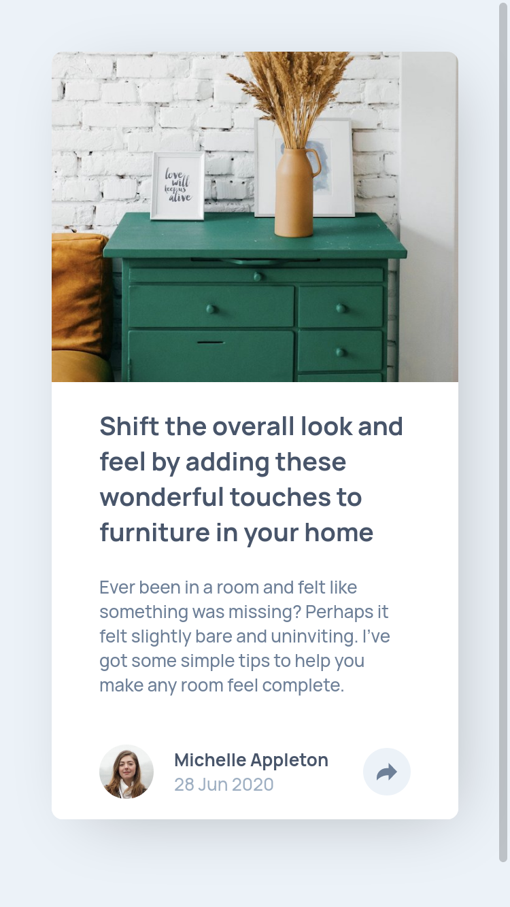
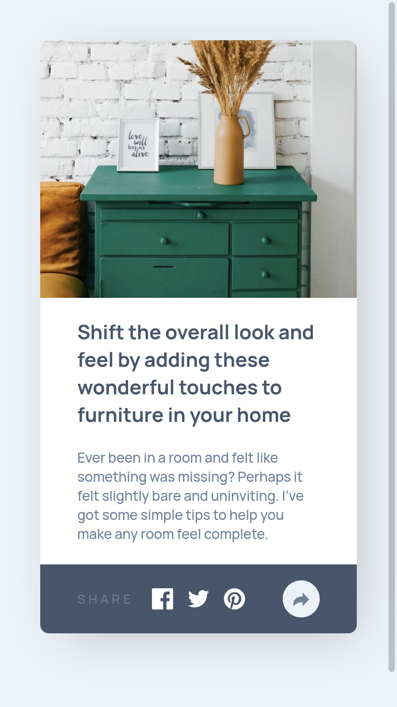

# Frontend Mentor - Article preview component solution

This is a solution to the [Article preview component challenge on Frontend Mentor](https://www.frontendmentor.io/challenges/article-preview-component-dYBN_pYFT). Frontend Mentor challenges help you improve your coding skills by building realistic projects. 

## Table of contents

- [Overview](#overview)
  - [The challenge](#the-challenge)
  - [Screenshot](#screenshot)
  - [Links](#links)
- [My process](#my-process)
  - [Built with](#built-with)
  - [What I learned](#what-i-learned)
  - [Useful resources](#useful-resources)
- [Author](#author)


## Overview

### The challenge

Users should be able to:

- View the optimal layout for the component depending on their device's screen size
- See the social media share links when they click the share icon

### Screenshot






### Links

- Solution URL: [Code](https://github.com/NafisHandoko/article-preview-component)
- Live Site URL: [Github Pages](https://nafishandoko.github.io/article-preview-component/)


## My process

### Built with

- HTML
- CSS custom properties
- Flexbox
- Vanilla Javascript

### What I learned

In this challenge, i learned quite a lot than previous challenge. I learned how we can set width and height of an anchor tag just by give it display property with any value except none.
Example :
```css
a{
  display: inline-block;
}
```

I also learned how to change svg element so that the color can be changed through CSS dynamically by changing the path fill attribute
from this
```html
<svg class="mysvg">
  <path fill="#[hex-color-here]" />
</svg>
```
to this
```html
<svg class="mysvg">
  <path fill="currentColor" />
</svg>
```
Then, we can change the color through css code
```css
.mysvg{
  color: #[hex-color-here]
}
```

And i also learned how to use media queries through javascript when the media queries change.
```js
window.matchMedia("(max-width:768px)").addEventListener("change",() => {
    // code goes here
})
```

### Useful resources

- [html - Setting a width and height on an A tag - Stack Overflow](https://stackoverflow.com/questions/4743254/setting-a-width-and-height-on-an-a-tag)
- [The Best Way to Embed SVG on HTML (2021)](https://vecta.io/blog/best-way-to-embed-svg)
- [css - How to change the color of an svg element? - Stack Overflow](https://stackoverflow.com/questions/22252472/how-to-change-the-color-of-an-svg-element/53336754#53336754)
- [css - What is the difference between visibility:hidden and display:none? - Stack Overflow](https://stackoverflow.com/questions/133051/what-is-the-difference-between-visibilityhidden-and-displaynone)
- [How To Use Media Queries in JavaScript](https://www.w3schools.com/howto/howto_js_media_queries.asp)
- [MediaQueryList.onchange - Web APIs | MDN](https://developer.mozilla.org/en-US/docs/Web/API/MediaQueryList/onchange)


## Author

- Website - [Nafis Handoko](https://nafishandoko.github.io)
- Frontend Mentor - [@nafishandoko](https://www.frontendmentor.io/profile/nafishandoko)
- Instagram - [@nafishandoko](https://www.instagram.com/nafishandoko)